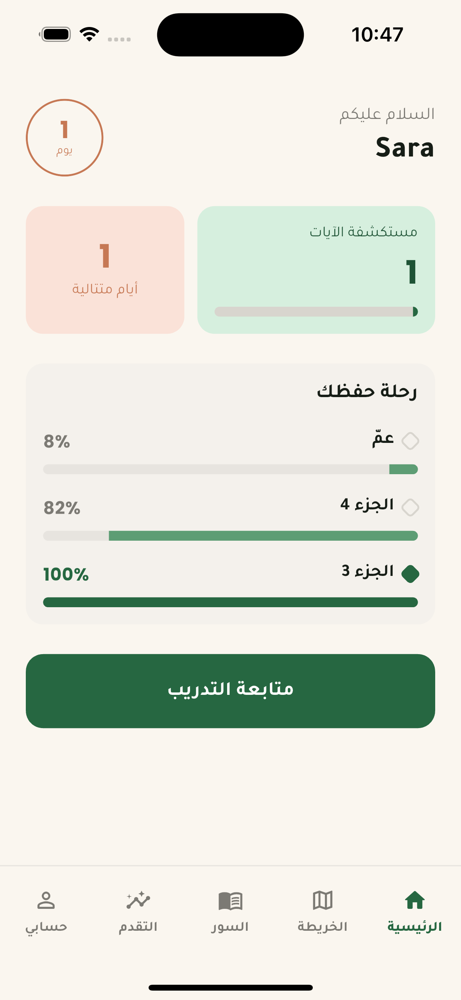
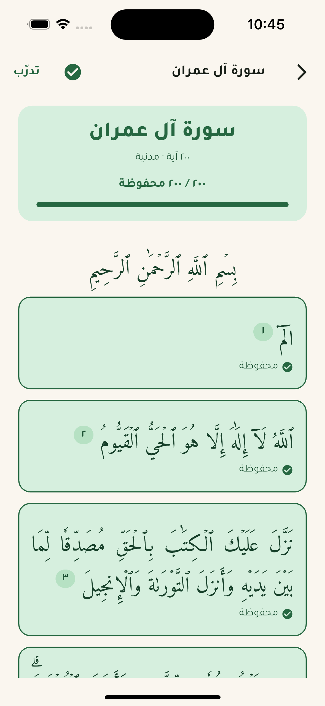
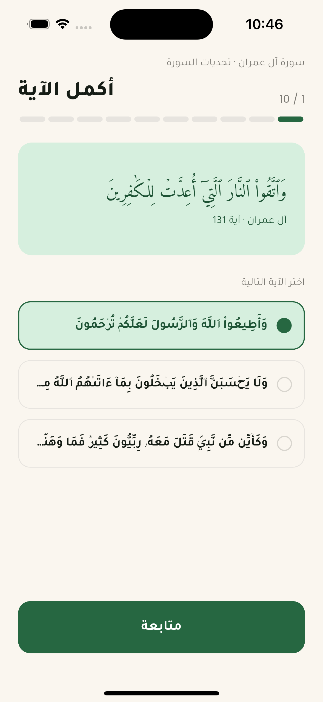

# Hifz Hero — حافظ القرآن

Hifz Hero is a Flutter app that helps you memorize the Quran and keep what you've memorized.
It is fully Arabic and right-to-left. It runs offline: the whole Quran text (all 114 surahs and 30 juz) is bundled with the app, and your progress is stored on your device.

You tell the app which ayahs you already know. It turns them into a daily revision plan, quizzes you with short challenges, and shows your progress across the 30 juz.

## Screenshots

<p align="center">
  
  &nbsp;
  
  &nbsp;
  
</p>

<p align="center">
  <b>Home</b> — streak, ayahs reviewed and juz progress &nbsp;·&nbsp;
  <b>Quran reader</b> — mark ayahs as memorized &nbsp;·&nbsp;
  <b>Challenges</b> — أكمل الآية and three other quiz types
</p>

## Key features

- **Memorization tracking by ayah.** Progress is stored as ayah ranges, not whole surahs, so you can record a long surah as partly memorized. You can mark single ayahs in the reader or whole surahs in the surah picker.
- **Spaced-repetition revision.** A Leitner-box scheduler builds today's revision plan from what you've memorized. It also ranks your weakest ayahs and shows a heatmap of the days you reviewed.
- **Challenges.** There are four multiple-choice quizzes: *أكمل الآية* (complete the ayah), *أي سورة هذه؟* (which surah is this?), *الكلمة الناقصة* (the missing word) and *خمّن الجزء* (guess the juz). Every answer counts as a review, so playing a challenge moves your revision schedule forward.
- **Hifz map.** The 30 juz are shown as a path. Each juz shows how much of it you've memorized, and it stays locked until you finish the one before it.
- **Quran reader.** The reader shows the Uthmani text with Arabic-Indic ayah markers. Tap an ayah to mark it as memorized.
- **Profile and streaks.** The app tracks your daily streak and XP from your review log. You can edit your photo, name and level.

## Tech stack

- Flutter, built with Clean Architecture (domain / data / presentation layers)
- BLoC for state management, `get_it` + `injectable` for dependency injection
- `dartz` `Either` for error handling
- `shared_preferences` for storing data on the device, `flutter_screenutil` for sizing on different screens
- Fonts: Tajawal for the interface, Amiri Quran for the Quran text

See [README_ARCHITECTURE.md](README_ARCHITECTURE.md) for how the code is organized, and [docs/BACKLOG.md](docs/BACKLOG.md) for what is built and what is planned.

## Getting started

```bash
flutter pub get
flutter run
```

Run the tests with:

```bash
flutter test
```
